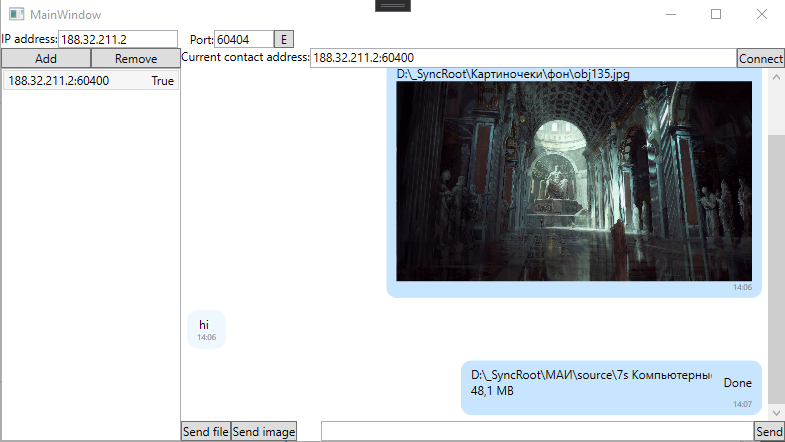
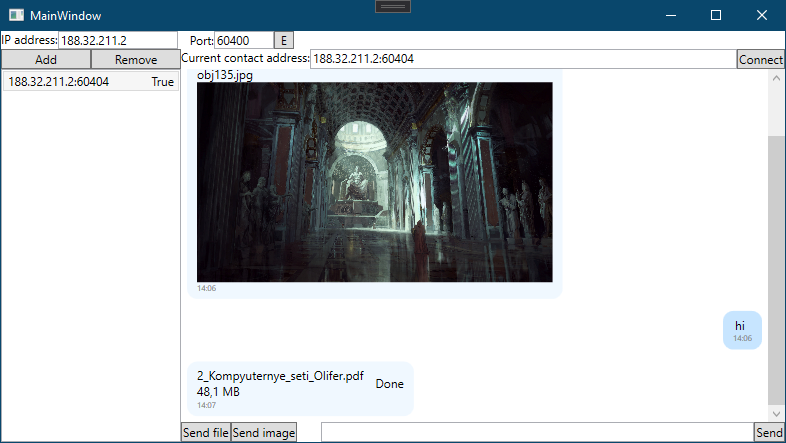

# Задача

Требуется создать одноранговый мессенджер, реализующий следующий
функционал:

1. Поддержка подключения к удалённому клиенту по IP адресу.
2. Шифрование с открытым ключом.
3. Передача текстовых сообщений.
4. Передача изображений в тексте с их показом.
5. Передача прочих файлов.

# Реализация

1-й пользователь:

2-й пользователь:
